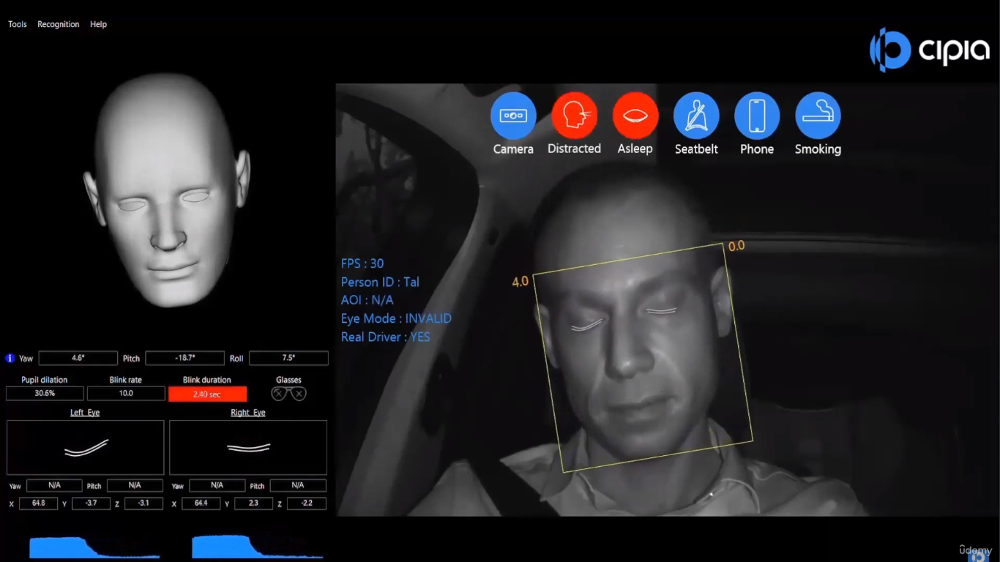
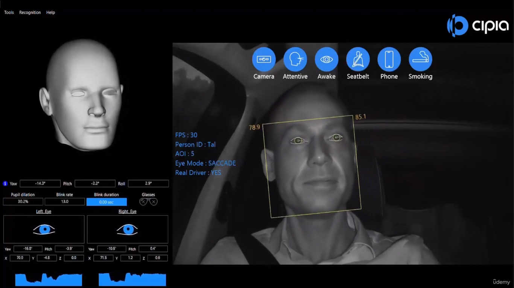
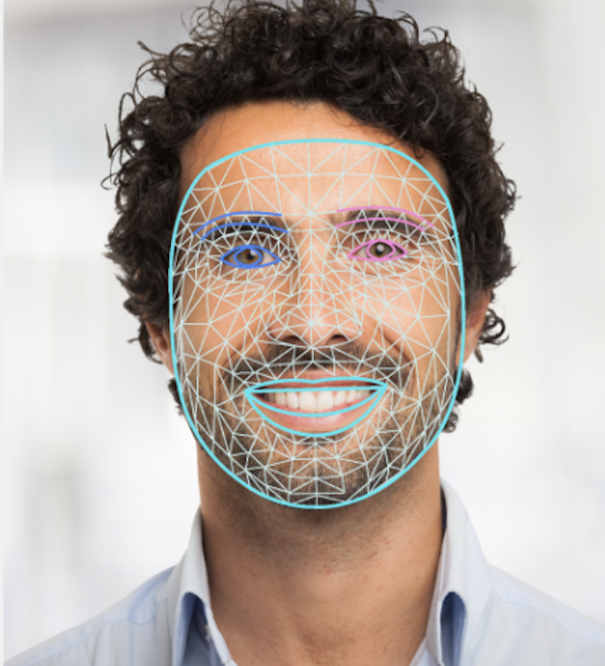

<h2 align="center"> 💻 Detecting_Sleep_PY </h2>
<br>

<h4 align="center"> 💻 Eye Monitoring with OpenCV and MediaPipe =>  This project uses the OpenCV library and the MediaPipe API to monitor the state of the eyes in real-time through the webcam. The goal is to detect whether the eyes are open or closed and to monitor the duration they remain closed.

  
---
## Features

- **Eye Detection**: Utilizes MediaPipe's FaceMesh to identify facial landmarks and determine the eye state.
- **Time Monitoring**: Counts the time the eyes remain closed and issues an alert if they are closed for 2 seconds or more.
- **Visual Interface**: Displays status messages about the eye state on the webcam screen.

## Requirements

- Python 3.x
- OpenCV
- MediaPipe
- NumPy

## Installation

To install the necessary libraries, you can use `pip`:
   ```python
    pip install opencv-python mediapipe numpy
   ```

---

<h4 align="center">Detecting_Sleep_PY  🚀</h4>

<div align="center">
    
    
</div>
<br>
<br>

<div align="center">
    
    

   
</div>


---
## Library

- https://github.com/google-ai-edge/mediapipe/blob/master/docs/solutions/face_mesh.md

- https://ai.google.dev/edge/mediapipe/solutions/vision/face_landmarker


---


## Code Explanation

 ### Importing Libraries
 -- The code starts by importing the essential libraries:
   ```python
    import cv2
    import mediapipe as mp
    import math
 ```

 - cv2: Used for image manipulation and video capture.
 - mediapipe: Used to detect facial landmarks.
 - math: Used to calculate the distance between points.


 ### MediaPipe Setup
 - Here, we initialize MediaPipe and set up the FaceMesh model:

```python
    mp_face_mesh = mp.solutions.face_mesh
    face_mesh = mp_face_mesh.FaceMesh()
    mp_drawing = mp.solutions.drawing_utils
 ```

 ### Processing Each Frame
 - Inside an infinite loop, the script captures frames from the webcam, resizes the image, converts it to RGB, and processes it to detect facial landmarks:

```python
   while True:
    check, img = video.read()
    img = cv2.resize(img, (1000, 720))
    img_rgb = cv2.cvtColor(img, cv2.COLOR_BGR2RGB)
    results = face_mesh.process(img_rgb)
    h, w, _ = img.shape

 ```

### Checking for Landmarks
 - If facial landmarks are detected, the code accesses specific points around the eyes (landmarks 159, 145, 386, and 374) to calculate the distance between these points:

```python
   if results.multi_face_landmarks:
    for face_landmarks in results.multi_face_landmarks:
        # Get the distance between eye points
        landmark_159 = face_landmarks.landmark[159]
        di1x, di1y = int((landmark_159.x)*w), int((landmark_159.y)*h)
        # ...
 ```

 ### Calculating Distances
 - Using the math.hypot() function, the code calculates the distance between two points for each eye. If the distance is below a certain threshold, the script concludes that the eyes are closed:

```python
    distDi = math.hypot(di1x-di2x, di1y-di2y)
distEs = math.hypot(es1x-es2x, es1y-es2y)

if distDi <= 10 and distEs <= 10:
    print("Eyes closed ☺")
    cv2.rectangle(img, (100, 30), (390, 80), (0, 0, 255), -1)
    cv2.putText(img, 'EYES CLOSED', (105, 65), cv2.FONT_HERSHEY_SIMPLEX, 1, (255, 255, 255), 3)
else:
    print('Eyes open 😨')
    cv2.rectangle(img, (100, 30), (370, 80), (0, 255, 0), -1)
    cv2.putText(img, 'Eyes open', (105, 65), cv2.FONT_HERSHEY_SIMPLEX, 1, (255, 255, 255), 3)

 ```

 ### Displaying the Image
 - The function cv2.imshow() is used to display the processed video:

```python
    cv2.imshow('IMG', img)
 ```

 ### Ending the Program
 - If the 'ESC' key is pressed, the program closes the window and releases the video capture:
```python
   if cv2.waitKey(1) & 0xFF == 27:
    break

   video.release()
   cv2.destroyAllWindows()
 ```
---


##  Example Output
 - The script draws points around the eyes and displays a message indicating whether the eyes are open or closed.

---

## Conclusion
 - This code demonstrates how to use OpenCV and MediaPipe to detect facial landmarks and calculate the distance between specific points to determine if the eyes are closed. It can be extended for other applications, such as fatigue or attention monitoring.

---
## License
- This project is licensed under the MIT License.
---


### 📦 Contribution

 - Feel free to contribute by submitting pull requests or reporting issues.

- #### My LinkedIn - [](https://www.linkedin.com/in/lucianadiemert/)

#### Contact


#### [**Luciana Diemert**](https://github.com/ludiemert)

🛠 Full-Stack Developer <br>
🖥️ Python Enthusiast | Computer Vision | AI Integrations <br>
📍 São Jose dos Campos – SP, Brazil

<a href="https://www.linkedin.com/in/lucianadiemert" target="_blank"></a>&nbsp;
<a href="mailto:lucianadiemert@gmail.com" target="_blank"></a>&nbsp;
<a href="#"></a>&nbsp;
<a href="https://www.github.com/ludiemert" target="_blank"></a>&nbsp;

<br clear="left"/>
